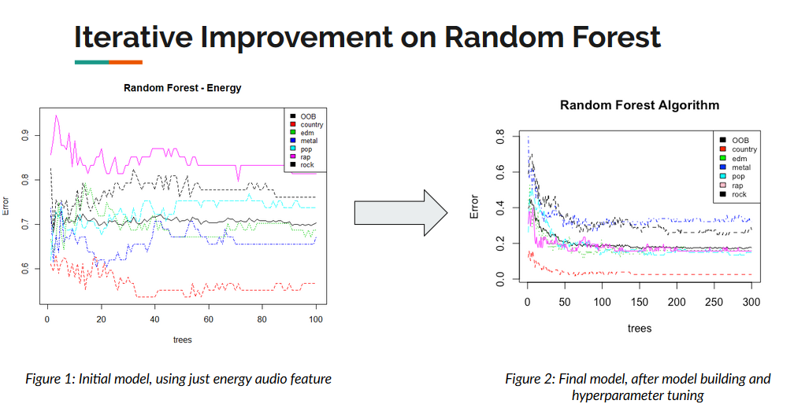

# MakesAHit

## Final Presentation
Looking for a TL;DR? Take a look at our final presentation to get an idea of what this project does: https://docs.google.com/presentation/d/e/2PACX-1vSQ89GPZbQcRiwf8o97hOvWL1dlJyL_Kdrq9HfyktNU0qZXspV0Z80RMo99h0PGGRGQvEi2eC46Th4m/pub?start=false&loop=false&delayms=3000

## Methodology
This repo is part of a class project that I contributed to for a team project in our Intro to Automated Learning and Data Analysis class. Essentially, we had to design and carry out a project that enlisted some of the techniques we had learned in class and it could be on whatever topic we wanted as long as we could justify our approach and interpret our results in a sound manner. The first part (this repo) uses the Random Forest algorithm for analyzing and grouping songs from a Spotify playlist based on song features into a genre. 

Here's an example: 

The second part (not included) was written by our teammate and it uses a genetic algorithm for generating Spotify playlists based on that analysis. You can see more about the methodology and results in the slideshow linked above!
